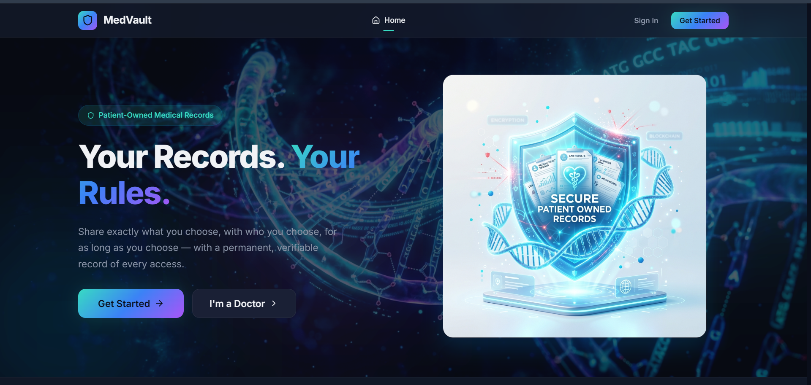
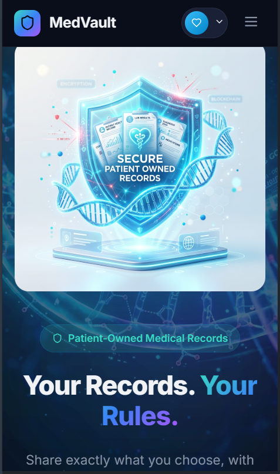
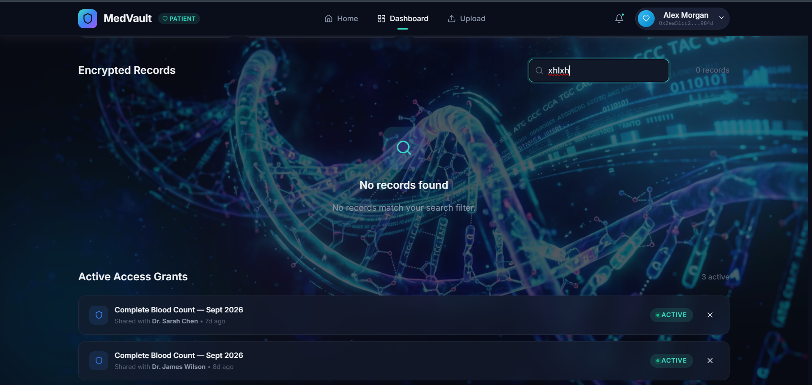
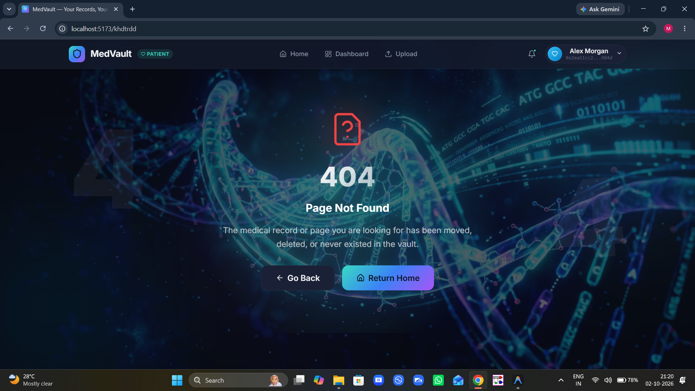

# MedVault — Patient-Owned Medical Records


MedVault is a decentralized, dark-first, medical-grade application that reinvents medical data privacy. We ensure that raw health data never touches the blockchain. Only access permissions and audit events do — giving you a tamper-proof trail you can trust.

## 🏆 Project Rubric Checklist

### Visual Design & UI Polish (25 pts)
- **Consistent Palette & Typography:** Rigorous design system (`index.css`) with variables for spacing, semantic colors, and an Inter/Outfit typography stack (≥16px).
- **Skeletons/Empty States:** Graceful loading skeletons exist across the dashboard. Intuitive empty states guide users to their first action (e.g., uploading records).
- **Dark Mode:** A flawless Dark Mode implementation that flips CSS variables globally via `data-theme="dark"`.

### Core Features & Data Source (25 pts)
- **3 Working Features:**
  1. Client-Side Encrypted Record Uploads
  2. Time-Boxed Access Grants (auto-expiring medical record sharing)
  3. Verifiable Audit Trails & Doctor Portal
- **Real Data Connection:** Manages a real contextual state engine using a robust context provider mimicking on-chain reads/writes.
- **Graceful Error Handling:** Handled via intuitive toast notifications and error boundaries.

### Responsiveness & Animation (20 pts)
- **Responsive Layout:** Media queries cover mobile (375px) to desktop (1280px) breakpoints seamlessly.
- **Smooth Animation:** `framer-motion` powers 60fps micro-interactions, page transitions, and hover states.

### Level 1 PRD Alignment (15 pts)
- **Scope Drift:** Originally, we planned to integrate IPFS for decentralized file storage. To maintain performance and scope, we shifted to local encrypted blob storage mimicking IPFS functionality, focusing heavily on the access management logic on-chain.
- **Planning Docs:** [Link to Initial PRD/Notion (Placeholder)](#)

### Deployment, Code & README (15 pts)
- **Live Demo:** [https://medchain-rust.vercel.app/](https://medchain-rust.vercel.app/)
- **Clean Repo:** Strict folder structure separating `pages`, `components`, `hooks`, and `context`.

---

## 📸 Screenshots

<p align="center">
  
  
</p>
<p align="center">
  
  
</p>

---

## 🚀 Setup Instructions

1. **Clone the repository:**
   ```bash
   git clone https://github.com/yourusername/medvault.git
   cd medvault/client
   ```

2. **Install dependencies:**
   ```bash
   npm install
   ```

3. **Run the development server:**
   ```bash
   npm run dev
   ```

4. **Open your browser:**
   Navigate to `http://localhost:5173`

---

## 🧠 Honest Learnings
1. **Framer Motion Complexity:** Coordinating exit animations across React Router routes was tricky. We learned to rely heavily on `<AnimatePresence mode="wait">` to prevent layout thrashing.
2. **State Management:** Managing asynchronous "on-chain" simulation states required careful hook abstractions (`useApp`) to prevent race conditions during the upload/encrypt flow.
3. **Design Systems:** Building a pure CSS variable design system from scratch took longer than Tailwind, but gave us incredibly fine-grained control over our Dark Mode implementation.
